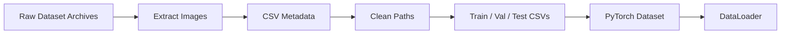
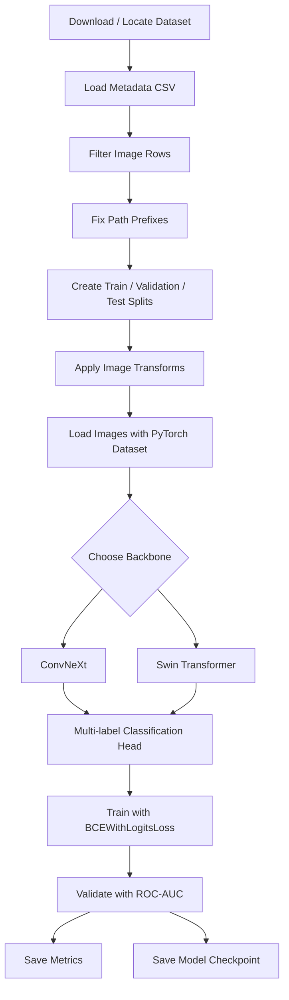
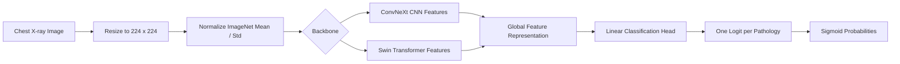
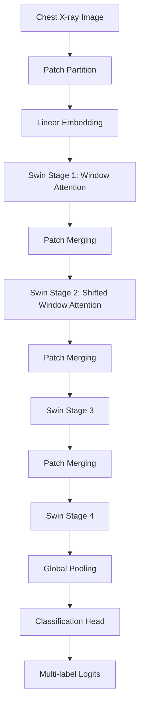
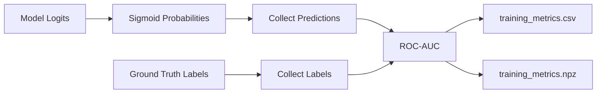

# Deep Learning for Chest X-Ray Diagnosis


This repository contains deep learning experiments for automated chest X-ray diagnosis. It focuses on multi-label thoracic disease classification using large-scale medical imaging datasets such as **CheXpert** and **NIH ChestX-ray14**.

The project explores both convolutional and transformer-based computer vision models, especially **ConvNeXt** and **Swin Transformer** backbones. The codebase includes dataset preparation, metadata cleaning, PyTorch dataset loaders, model training, validation, ROC-AUC evaluation, checkpoint saving, visualization utilities, and SLURM scripts for running experiments on GPU/HPC systems.

> **Important:** This project is for research and learning purposes only. It is not a clinical diagnostic system.

---

## Table of Contents

- [Project Overview](#project-overview)
- [Repository Contents](#repository-contents)
- [Datasets](#datasets)
- [Task Definition](#task-definition)
- [Experiment Matrix](#experiment-matrix)
- [Pipeline](#pipeline)
- [Model Architecture](#model-architecture)
- [ConvNeXt Backbone](#convnext-backbone)
- [Swin Transformer Backbone](#swin-transformer-backbone)
- [Backbone Comparison](#backbone-comparison)
- [Training Setup](#training-setup)
- [Evaluation](#evaluation)
- [Outputs](#outputs)
- [Setup Guide](#setup-guide)
- [Running the Project](#running-the-project)
- [HPC / SLURM Usage](#hpc--slurm-usage)
- [Troubleshooting](#troubleshooting)
- [Suggested Improvements](#suggested-improvements)
- [Ethical Notes](#ethical-notes)

---

## Project Overview

Chest X-rays are one of the most common medical imaging exams. This project uses deep neural networks to classify chest radiographs into multiple disease categories at once. Unlike single-label classification, a single X-ray can contain several findings, so the model is trained as a **multi-label classifier**.

The project includes experiments with:

| Backbone family | Type | Why it is useful |
|---|---|---|
| ConvNeXt | Modern convolutional neural network | Strong image features, efficient transfer learning, good baseline for medical imaging. |
| Swin Transformer | Hierarchical vision transformer | Captures local and broader spatial context using shifted-window attention. |

### Goals

| Goal | Description |
|---|---|
| Dataset preparation | Download, organize, filter, and clean chest X-ray metadata and image paths. |
| Multi-label classification | Predict multiple thoracic findings from each X-ray image. |
| Transfer learning | Use pretrained ConvNeXt and Swin Transformer backbones with custom classification heads. |
| Evaluation | Measure performance using training loss, validation loss, macro ROC-AUC, and optional per-class AUC. |
| Visualization | Generate dataset samples, label distribution plots, training curves, and explainability figures. |
| HPC training | Run training jobs through SLURM on GPU-enabled clusters. |
| Reproducibility | Save metrics, checkpoints, split files, and experiment outputs. |

---

## Repository Contents

The repository currently contains notebooks/scripts for:

| Component | Purpose |
|---|---|
| Dataset download notebook | Downloads NIH ChestX-ray14 image archives from NIH-hosted Box links. |
| Experiment notebooks | Test dataset loading, path cleaning, model imports, and early training experiments. |
| Training scripts | Train ConvNeXt/Swin-style models on CheXpert-style image-label CSV files. |
| SLURM scripts | Submit GPU or CPU training jobs on a computing cluster. |
| Metrics outputs | Save loss/AUC curves into CSV or NumPy files. |
| `.gitignore` | Excludes virtual environments, model checkpoints, Weights & Biases files, outputs, and notebook checkpoints. |

Typical ignored artifacts include:

```text
.venv/
venv/
wandb/
outputs/
*.pt
*.pth
*.ckpt
*.wandb
__pycache__/
.ipynb_checkpoints/
```

---

## Datasets

The project references two major chest X-ray datasets.

### 1. CheXpert

CheXpert is used as the main training/evaluation-style dataset in the training code. The scripts expect CSV metadata files with image paths and pathology labels.

Expected files/paths may include:

```text
train_cheXbert.csv
filtered_chexpert.csv
train_split.csv
val_split.csv
val_labels.csv
test_labels.csv
```

Example root paths used in the experiments:

```text
/scratch/smanika3/chexpert/full_uncompressed/train
/scratch/pchalla7/chexpert/chexlocalize/CheXpert
```

Update these paths based on your own system before training.

### 2. NIH ChestX-ray14

The download notebook includes links for downloading compressed NIH image archives such as:

```text
images_01.tar.gz
images_02.tar.gz
...
images_12.tar.gz
```

The full download can take tens of gigabytes of storage, because medical imaging datasets apparently enjoy cosplaying as small planets.

### Dataset Image Examples

Actual medical images are not committed to this repository. Once the dataset is downloaded, sample images can be visualized locally:

```python
import matplotlib.pyplot as plt
from PIL import Image

sample_path = "path/to/sample_chest_xray.jpg"
img = Image.open(sample_path).convert("L")

plt.figure(figsize=(5, 5))
plt.imshow(img, cmap="gray")
plt.axis("off")
plt.title("Sample Chest X-ray")
plt.show()
```



---

## Task Definition

This is a **multi-label binary classification** problem. For each X-ray image, the model predicts a probability for each disease label.

| Image | Atelectasis | Cardiomegaly | Consolidation | Edema | Pleural Effusion |
|---|---:|---:|---:|---:|---:|
| `patient001/study1/view1.jpg` | 0.12 | 0.91 | 0.08 | 0.76 | 0.44 |

Each label is treated independently using sigmoid outputs rather than softmax.

### Label Handling

The notebook code handles uncertain labels by replacing `-1` with `1` in one experiment:

```python
df.replace(to_replace=-1, value=1, inplace=True)
```

This means uncertain findings are treated as positive. This should be tracked clearly because label policy can significantly affect model behavior.

---

## Experiment Matrix

This table summarizes the major combinations tried or represented in the project and what each one is meant to do.

| Dataset / Source | Model / Backbone | Input Size | Training Setup | Task | Loss / Objective | Evaluation | Purpose |
|---|---|---:|---|---|---|---|---|
| NIH ChestX-ray14 | Dataset download workflow | N/A | Download notebook with NIH archive links | Dataset preparation | N/A | File presence / checksum review | Download and organize large chest X-ray image archives. |
| CheXpert | Metadata filtering + path cleaning | N/A | Pandas preprocessing | Dataset cleanup | N/A | Path existence checks | Remove incorrect prefixes and create usable CSV files. |
| CheXpert | Train/validation split workflow | N/A | `train_test_split` / CSV generation | Split creation | N/A | Split inspection | Create train and validation CSV files for controlled experiments. |
| CheXpert | Custom PyTorch Dataset | 224 x 224 | `Dataset` + `DataLoader` | Image-label loading | N/A | Batch shape / label checks | Load X-rays and multi-hot pathology labels for training. |
| CheXpert | ConvNeXt-Base | 224 x 224 | PyTorch + TIMM | Multi-label thoracic disease classification | `BCEWithLogitsLoss` | Macro ROC-AUC | Main CNN-style baseline model. |
| CheXpert | ConvNeXt-Large | 224 x 224 | PyTorch + TIMM + GPU/SLURM | Multi-label thoracic disease classification | Weighted `BCEWithLogitsLoss` | Macro ROC-AUC | Higher-capacity CNN experiment to test scaling. |
| CheXpert | Swin Transformer Tiny/Base | 224 x 224 | PyTorch + TIMM | Multi-label thoracic disease classification | `BCEWithLogitsLoss` | Macro ROC-AUC | Transformer-based comparison against ConvNeXt. |
| CheXpert | Swin Transformer + class balancing | 224 x 224 | PyTorch + TIMM + `pos_weight` | Imbalanced multi-label classification | Weighted `BCEWithLogitsLoss` | Macro / per-class ROC-AUC | Reduce bias toward common labels and improve rare finding sensitivity. |
| CheXpert official val/test | ConvNeXt or Swin checkpoint | 224 x 224 | Train on filtered CheXpert, evaluate on official splits | Generalization testing | Same as selected model | Validation/test ROC-AUC | Compare model behavior on held-out official splits. |
| CheXpert | Mixed precision training | 224 x 224 | AMP / `GradScaler` | Faster GPU training | Same as selected model | Loss + ROC-AUC | Reduce memory usage and speed up larger experiments. |
| CheXpert | Grad-CAM / explainability workflow | 224 x 224 | Trained checkpoint + visualization utility | Visual explanation | N/A | Heatmap inspection | Show which image regions influence predictions. |
| CheXpert | SLURM GPU jobs | 224 x 224 | Cluster job scripts | Scalable training | Same as selected model | Training logs + metrics CSV | Run longer experiments on HPC resources. |

---

## Pipeline



---

## Model Architecture

The project uses pretrained vision backbones through `timm`, then replaces the classifier head so the final layer outputs one logit per pathology.

| Model | Family | Description | Usage |
|---|---|---|---|
| `convnext_base` | ConvNeXt | Medium-sized modern CNN backbone. | Main CNN-style baseline. |
| `convnext_large` | ConvNeXt | Larger higher-capacity ConvNeXt model. | Higher-capacity experiment. |
| `swin_tiny_patch4_window7_224` | Swin Transformer | Lightweight shifted-window transformer. | Efficient transformer baseline. |
| `swin_base_patch4_window7_224` | Swin Transformer | Larger hierarchical transformer. | Strong transformer experiment. |
| `swin_large_patch4_window7_224` | Swin Transformer | High-capacity transformer backbone. | Expensive experiment for larger GPUs. |

```python
import timm

num_classes = train_dataset.labels.shape[1]
model_name = "convnext_base"  # or "swin_base_patch4_window7_224"

model = timm.create_model(
    model_name,
    pretrained=True,
    num_classes=num_classes
)
```



---

## ConvNeXt Backbone

ConvNeXt is a modern convolutional architecture designed to keep the efficiency and locality of CNNs while adopting training and design ideas popularized by vision transformers.

| Strength | Relevance for chest X-rays |
|---|---|
| Strong local feature extraction | Useful for localized radiological findings. |
| Pretrained weights | Helps when medical labels are limited or noisy. |
| Stable training | Good baseline for multi-label classification. |
| Efficient inference | Practical compared with very large transformer models. |

```python
model = timm.create_model(
    "convnext_base",
    pretrained=True,
    num_classes=num_classes
)
```

```python
model = timm.create_model(
    "convnext_large",
    pretrained=True,
    num_classes=num_classes
)
```

---

## Swin Transformer Backbone

Swin Transformer is a hierarchical vision transformer. Instead of applying global self-attention over the entire image at once, it computes attention inside local windows and shifts those windows across layers. This lets the model capture both local and broader spatial relationships without turning GPU memory into a smoking crater.

| Strength | Relevance for chest X-rays |
|---|---|
| Window-based attention | Captures structured regional patterns in lungs, heart, and pleura. |
| Shifted windows | Allows information flow across neighboring regions. |
| Hierarchical features | Produces multi-scale visual representations. |
| Transformer backbone | Useful comparison against CNN-style ConvNeXt models. |



```python
model = timm.create_model(
    "swin_base_patch4_window7_224",
    pretrained=True,
    num_classes=num_classes
)
```

---

## Backbone Comparison

| Feature | ConvNeXt | Swin Transformer |
|---|---|---|
| Architecture type | Convolutional neural network | Hierarchical vision transformer |
| Main operation | Convolutions | Shifted-window self-attention |
| Local feature bias | Strong | Learned through window attention |
| Long-range context | Indirect through deeper layers | Stronger through shifted windows |
| Memory usage | Usually lower | Usually higher |
| Training speed | Often faster | Can be slower depending on GPU |
| Best use | Strong baseline and efficient training | Context-aware transformer comparison |

| Experiment | Backbone | Purpose |
|---|---|---|
| Baseline | `convnext_base` | Fast, strong reference model. |
| CNN scale-up | `convnext_large` | Test whether more CNN capacity improves AUC. |
| Transformer baseline | `swin_tiny_patch4_window7_224` | Test Swin efficiently. |
| Transformer scale-up | `swin_base_patch4_window7_224` | Strong Swin comparison. |
| High-capacity run | `swin_large_patch4_window7_224` | Only if GPU memory allows. |

---

## Training Setup

| Package | Purpose |
|---|---|
| `torch` | Model training and tensor operations. |
| `torchvision` | Image transforms and utilities. |
| `timm` | ConvNeXt and Swin Transformer model creation. |
| `pandas` | CSV loading and preprocessing. |
| `numpy` | Numerical operations and metric storage. |
| `Pillow` | Image loading. |
| `scikit-learn` | ROC-AUC metrics and train/validation splitting. |
| `matplotlib` | Dataset and metrics visualization. |

```python
from torchvision import transforms

train_transforms = transforms.Compose([
    transforms.Resize((224, 224)),
    transforms.ToTensor(),
    transforms.Normalize([0.485, 0.456, 0.406],
                         [0.229, 0.224, 0.225])
])
```

```python
criterion = nn.BCEWithLogitsLoss()
criterion_weighted = nn.BCEWithLogitsLoss(pos_weight=pos_weight)
```

---

## Evaluation

| Metric | Meaning |
|---|---|
| Training loss | Average BCE loss over the training set. |
| Validation loss | Average BCE loss over the validation set. |
| Macro ROC-AUC | Average ROC-AUC across all labels. |
| Per-class ROC-AUC | AUC for each pathology label. Useful for seeing which findings are weak. |
| Average precision | Optional metric for imbalanced labels. |

```python
from sklearn.metrics import roc_auc_score

auc = roc_auc_score(labels_all, preds_all, average="macro")
```



After running experiments, report results like this:

| Backbone | Epochs | Batch Size | Input Size | Val Loss | Macro ROC-AUC |
|---|---:|---:|---:|---:|---:|
| `convnext_base` | TBD | TBD | 224 | TBD | TBD |
| `convnext_large` | TBD | TBD | 224 | TBD | TBD |
| `swin_tiny_patch4_window7_224` | TBD | TBD | 224 | TBD | TBD |
| `swin_base_patch4_window7_224` | TBD | TBD | 224 | TBD | TBD |

---

## Outputs

| Output | Description |
|---|---|
| `training_metrics.csv` | Per-epoch training and validation metrics. |
| `training_metrics.npz` | NumPy archive of training metrics. |
| `convnext_chexpert.pth` | Saved ConvNeXt checkpoint. |
| `convnext_large_chexpert_last.pth` | Final checkpoint for ConvNeXt-Large experiment. |
| `swin_chexpert.pth` | Suggested checkpoint name for Swin experiments. |
| `swin_base_chexpert_last.pth` | Suggested final checkpoint name for Swin-Base. |

---

## Setup Guide

```bash
git clone https://github.com/prasannanjaneyreddychalla/deep_learning.git
cd deep_learning
python3 -m venv .venv
source .venv/bin/activate
pip install --upgrade pip
pip install torch torchvision timm pandas numpy scikit-learn pillow matplotlib
```

Update dataset constants inside the training script/notebook:

```python
RAW_CSV = "/path/to/train_cheXbert.csv"
TRAIN_ROOT = "/path/to/train/images"
VAL_CSV = "/path/to/val_labels.csv"
TEST_CSV = "/path/to/test_labels.csv"
CHEXPERT_ROOT = "/path/to/CheXpert"
```

Verify paths before training:

```python
import os
import pandas as pd

df = pd.read_csv("filtered_chexpert.csv")
root = "/path/to/images"
for p in df["Path"].head(10):
    print(os.path.join(root, p), os.path.exists(os.path.join(root, p)))
```

---

## Running the Project

```bash
jupyter lab
```

or:

```bash
python3 -u final_train.py | tee training.log
```

Choose a backbone in code:

```python
model_name = "convnext_base"
# model_name = "convnext_large"
# model_name = "swin_tiny_patch4_window7_224"
# model_name = "swin_base_patch4_window7_224"

model = timm.create_model(
    model_name,
    pretrained=True,
    num_classes=num_classes
)
```

---

## HPC / SLURM Usage

```bash
#SBATCH --job-name=ChestXray_Train
#SBATCH --partition=gpu
#SBATCH --gpus=1
```

```bash
sbatch train_gpu.sh
squeue -u $USER
scancel <job_id>
```

| Check | Command / Action |
|---|---|
| Confirm GPU availability | `nvidia-smi` |
| Confirm Python environment | `which python3` |
| Confirm packages | `python3 -c "import torch, timm"` |
| Confirm submit directory | `echo $SLURM_SUBMIT_DIR` |
| Monitor output | `tail -f slurm-<jobid>.out` |

| Backbone | GPU memory expectation |
|---|---|
| `convnext_base` | Moderate |
| `convnext_large` | High |
| `swin_tiny_patch4_window7_224` | Moderate |
| `swin_base_patch4_window7_224` | High |
| `swin_large_patch4_window7_224` | Very high |

---

## Troubleshooting

### `ImportError: cannot import name 'convnext_base' from torchvision.models`

Use `timm`:

```python
import timm
model = timm.create_model("convnext_base", pretrained=True, num_classes=num_classes)
```

### Swin model name not found

```python
import timm
print([m for m in timm.list_models("*swin*") if "224" in m])
```

### `FileNotFoundError` for CheXpert image paths

```python
df["Path"] = df["Path"].apply(
    lambda x: x.replace("CheXpert-v1.0/train/", "").replace("train/", "")
)
```

### CUDA out of memory

| Fix | Why it helps |
|---|---|
| Reduce batch size | Uses less GPU memory. |
| Use `convnext_base` or `swin_tiny` | Smaller backbone. |
| Enable mixed precision | Reduces activation memory. |
| Use gradient accumulation | Simulates larger batches safely. |
| Freeze early layers | Reduces trainable parameter memory and compute. |

---

## Suggested Improvements

| Area | Improvement |
|---|---|
| Config management | Move paths, backbone name, and hyperparameters into YAML or JSON config files. |
| Backbone experiments | Run ConvNeXt and Swin under the same data split for fair comparison. |
| Reproducibility | Add random seeds for NumPy, PyTorch, and DataLoader workers. |
| Metrics | Save per-class ROC-AUC in addition to macro ROC-AUC. |
| Explainability | Add Grad-CAM for ConvNeXt and attention/rollout-style visualizations for Swin. |
| Data validation | Add a script that checks CSV paths before training. |
| Documentation | Add sample generated plots under an `assets/` folder. |
| Packaging | Add `requirements.txt` or `environment.yml`. |
| Experiment tracking | Integrate Weights & Biases or MLflow cleanly. |

---

## Suggested Assets Folder

```text
assets/
├── sample_xrays.png
├── label_distribution.png
├── convnext_architecture.png
├── swin_architecture.png
├── training_loss.png
├── validation_auc.png
├── backbone_comparison.png
└── gradcam_examples.png
```

```markdown


```

---

## Ethical Notes

Medical AI systems can encode dataset bias, fail under distribution shift, and produce misleadingly confident predictions. This repository should be treated as a research prototype, not as a medical device.

Before any real-world clinical use, a system like this would require external validation, demographic subgroup evaluation, calibration analysis, clinical expert review, regulatory compliance, privacy review, and human-in-the-loop workflows.

---

## Summary

This project builds deep learning models for multi-label chest X-ray diagnosis. It prepares CheXpert/NIH-style metadata, loads X-ray images with PyTorch, trains pretrained ConvNeXt and Swin Transformer backbones, evaluates with macro ROC-AUC, saves metrics/checkpoints, and supports running experiments on SLURM-based compute clusters.

The README uses tables and Mermaid diagrams for clarity so the project remains easy to understand directly on GitHub.
