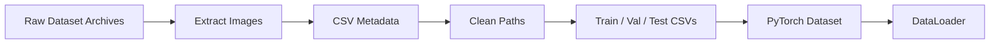
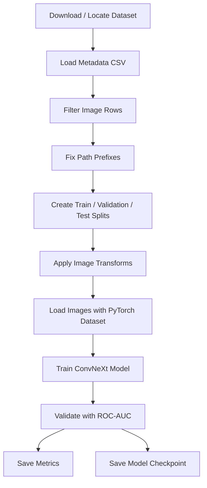
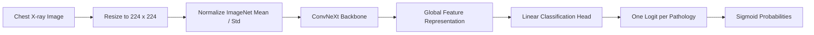
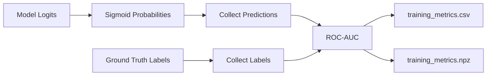

# Deep Learning for Chest X-Ray Diagnosis


This repository contains deep learning experiments for automated chest X-ray diagnosis. The project focuses on training ConvNeXt-based computer vision models for multi-label thoracic disease classification using large-scale medical imaging datasets such as CheXpert and NIH ChestX-ray14.

The codebase includes dataset preparation, path cleaning, PyTorch dataset loaders, model training, validation, ROC-AUC evaluation, checkpoint saving, and SLURM scripts for running jobs on GPU/HPC systems.

> **Important:** This project is for research and learning purposes only. It is not a clinical diagnostic system.

---

## Table of Contents

- [Project Overview](#project-overview)
- [Repository Contents](#repository-contents)
- [Datasets](#datasets)
- [Task Definition](#task-definition)
- [Pipeline](#pipeline)
- [Model Architecture](#model-architecture)
- [Training Setup](#training-setup)
- [Evaluation](#evaluation)
- [Outputs](#outputs)
- [Setup Guide](#setup-guide)
- [Running the Project](#running-the-project)
- [HPC / SLURM Usage](#hpc--slurm-usage)
- [Troubleshooting](#troubleshooting)
- [Suggested Improvements](#suggested-improvements)
- [Ethical Notes](#ethical-notes)

---

## Project Overview

Chest X-rays are one of the most common medical imaging exams. This project uses deep neural networks to classify chest radiographs into multiple disease categories at once. Unlike single-label classification, a single X-ray can contain several findings, so the model is trained as a **multi-label classifier**.

The main model family used here is **ConvNeXt**, a modern convolutional neural network architecture that combines strong CNN inductive bias with design choices inspired by vision transformers.

### Goals

| Goal | Description |
|---|---|
| Dataset preparation | Download, organize, filter, and clean chest X-ray metadata and image paths. |
| Multi-label classification | Predict multiple thoracic findings from each X-ray image. |
| Transfer learning | Use pretrained ConvNeXt backbones and replace the classification head. |
| Evaluation | Measure performance using loss and macro ROC-AUC. |
| HPC training | Run training jobs through SLURM on GPU-enabled clusters. |
| Reproducibility | Save training metrics, checkpoints, and split files. |

---

## Repository Contents

The repository currently contains notebooks/scripts for:

| Component | Purpose |
|---|---|
| Dataset download notebook | Downloads NIH ChestX-ray14 image archives from NIH-hosted Box links. |
| Experiment notebook | Tests dataset loading, ConvNeXt imports, training setup, and early experiments. |
| Training scripts | Train ConvNeXt models on CheXpert-style image-label CSV files. |
| SLURM scripts | Submit GPU or CPU training jobs on a computing cluster. |
| `.gitignore` | Excludes virtual environments, model checkpoints, Weights & Biases files, outputs, and notebook checkpoints. |

Typical ignored artifacts include:

```text
.venv/
venv/
wandb/
outputs/
*.pt
*.pth
*.ckpt
*.wandb
__pycache__/
.ipynb_checkpoints/
```

This is sensible because pushing multi-gigabyte model checkpoints to GitHub is how repositories become geological formations.

---

## Datasets

The project references two major chest X-ray datasets:

### 1. CheXpert

CheXpert is used as the main training/evaluation-style dataset in the training code. The scripts expect CSV metadata files with image paths and pathology labels.

Expected files/paths may include:

```text
train_cheXbert.csv
filtered_chexpert.csv
train_split.csv
val_split.csv
val_labels.csv
test_labels.csv
```

Example root paths used in the experiments:

```text
/scratch/smanika3/chexpert/full_uncompressed/train
/scratch/pchalla7/chexpert/chexlocalize/CheXpert
```

You should update these paths based on your own system.

### 2. NIH ChestX-ray14

The download notebook includes links for downloading compressed NIH image archives such as:

```text
images_01.tar.gz
images_02.tar.gz
...
images_12.tar.gz
```

The notebook output shows the full dataset download can take tens of gigabytes of storage. Plan disk space before running downloads, because your filesystem will not appreciate surprise radiology hoarding.

### Dataset Image Examples

Actual medical images are not committed to this repository. Once the dataset is downloaded, sample images can be visualized locally with code like this:

```python
import matplotlib.pyplot as plt
from PIL import Image

sample_path = "path/to/sample_chest_xray.jpg"
img = Image.open(sample_path).convert("L")

plt.figure(figsize=(5, 5))
plt.imshow(img, cmap="gray")
plt.axis("off")
plt.title("Sample Chest X-ray")
plt.show()
```

Example layout for dataset inspection:



---

## Task Definition

This is a **multi-label binary classification** problem.

For each X-ray image, the model predicts a probability for each disease label.

Example:

| Image | Atelectasis | Cardiomegaly | Consolidation | Edema | Pleural Effusion |
|---|---:|---:|---:|---:|---:|
| `patient001/study1/view1.jpg` | 0.12 | 0.91 | 0.08 | 0.76 | 0.44 |

Each label is treated independently using sigmoid outputs rather than softmax. That means multiple labels can be positive at the same time, which is exactly what you want in medical imaging and exactly what you do not want in a restaurant order.

### Label Handling

The notebook code handles uncertain labels by replacing `-1` with `1` in one experiment:

```python
df.replace(to_replace=-1, value=1, inplace=True)
```

This means uncertain findings are treated as positive. This is one common approach, but it should be documented clearly because label policy can significantly affect model behavior.

---

## Pipeline



---

## Model Architecture

The project uses pretrained ConvNeXt backbones through `timm`, including:

| Model | Description | Usage |
|---|---|---|
| `convnext_base` | Medium-sized ConvNeXt backbone | Main baseline model. |
| `convnext_large` | Larger ConvNeXt model | Higher-capacity experiment. |

The pretrained classification head is replaced with a new head matching the number of disease labels.

```python
import timm

num_classes = train_dataset.labels.shape[1]
model = timm.create_model(
    "convnext_base",
    pretrained=True,
    num_classes=num_classes
)
```

### Architecture Diagram



### Training Objective

The model uses `BCEWithLogitsLoss`, which combines sigmoid activation and binary cross-entropy in a numerically stable way.

```python
criterion = nn.BCEWithLogitsLoss()
```

For class imbalance, one training script uses positive class weighting:

```python
criterion = nn.BCEWithLogitsLoss(pos_weight=pos_weight)
```

That matters because medical datasets are usually imbalanced. Some findings are common, others are rare, and neural networks are very happy to ignore rare things unless bullied mathematically.

---

## Training Setup

### Core Dependencies

| Package | Purpose |
|---|---|
| `torch` | Model training and tensor operations. |
| `torchvision` | Image transforms and utilities. |
| `timm` | ConvNeXt model creation. |
| `pandas` | CSV loading and preprocessing. |
| `numpy` | Numerical operations and metric storage. |
| `Pillow` | Image loading. |
| `scikit-learn` | ROC-AUC metrics and train/validation splitting. |
| `matplotlib` | Dataset and metrics visualization. |

### Image Transforms

Typical transforms include:

```python
from torchvision import transforms

train_transforms = transforms.Compose([
    transforms.Resize((224, 224)),
    transforms.ToTensor(),
    transforms.Normalize([0.485, 0.456, 0.406],
                         [0.229, 0.224, 0.225])
])
```

The normalization values are ImageNet defaults, which match the pretrained ConvNeXt backbone.

---

## Evaluation

The project evaluates model quality using:

| Metric | Meaning |
|---|---|
| Training loss | Average BCE loss over the training set. |
| Validation loss | Average BCE loss over the validation set. |
| Macro ROC-AUC | Average ROC-AUC across all labels. |

Example evaluation logic:

```python
from sklearn.metrics import roc_auc_score

auc = roc_auc_score(labels_all, preds_all, average="macro")
```

### Metrics Visualization

Once `training_metrics.csv` exists, plot loss and ROC-AUC like this:

```python
import pandas as pd
import matplotlib.pyplot as plt

metrics = pd.read_csv("training_metrics.csv")

plt.figure(figsize=(8, 5))
plt.plot(metrics["epoch"], metrics["train_loss"], label="Train Loss")
plt.plot(metrics["epoch"], metrics["val_loss"], label="Validation Loss")
plt.xlabel("Epoch")
plt.ylabel("Loss")
plt.title("Training and Validation Loss")
plt.legend()
plt.grid(True)
plt.show()

plt.figure(figsize=(8, 5))
plt.plot(metrics["epoch"], metrics["val_auc"], label="Validation ROC-AUC")
plt.xlabel("Epoch")
plt.ylabel("Macro ROC-AUC")
plt.title("Validation ROC-AUC")
plt.legend()
plt.grid(True)
plt.show()
```

Example metrics flow:



---

## Outputs

Training scripts save artifacts such as:

| Output | Description |
|---|---|
| `training_metrics.csv` | Per-epoch training and validation metrics. |
| `training_metrics.npz` | NumPy archive of training metrics. |
| `convnext_chexpert.pth` | Saved ConvNeXt checkpoint. |
| `convnext_large_chexpert_last.pth` | Final checkpoint for ConvNeXt-Large experiment. |

These files may be ignored by Git depending on size and `.gitignore` settings.

---

## Setup Guide

### 1. Clone the repository

```bash
git clone https://github.com/prasannanjaneyreddychalla/deep_learning.git
cd deep_learning
```

### 2. Create a virtual environment

```bash
python3 -m venv .venv
source .venv/bin/activate
```

On Windows:

```bash
python -m venv .venv
.venv\Scripts\activate
```

### 3. Install dependencies

```bash
pip install --upgrade pip
pip install torch torchvision timm pandas numpy scikit-learn pillow matplotlib
```

If you are using a CUDA GPU, install the PyTorch build that matches your CUDA version from the official PyTorch installation selector.

### 4. Prepare dataset paths

Update dataset constants inside the training script/notebook:

```python
RAW_CSV = "/path/to/train_cheXbert.csv"
TRAIN_ROOT = "/path/to/train/images"
VAL_CSV = "/path/to/val_labels.csv"
TEST_CSV = "/path/to/test_labels.csv"
CHEXPERT_ROOT = "/path/to/CheXpert"
```

### 5. Verify image paths

Before training, confirm a few paths resolve correctly:

```python
import os
import pandas as pd

csv_path = "filtered_chexpert.csv"
root = "/path/to/images"

df = pd.read_csv(csv_path)
for p in df["Path"].head(10):
    full_path = os.path.join(root, p)
    print(full_path, os.path.exists(full_path))
```

If this prints `False`, fix paths before training. Debugging missing files during epoch 1 is how people discover new forms of suffering.

---

## Running the Project

### Option 1: Run through notebook

Open the notebook and execute cells in order:

```bash
jupyter notebook
```

or:

```bash
jupyter lab
```

### Option 2: Run training script

If using the script-based flow:

```bash
python3 final_train.py
```

### Option 3: Run with logging

```bash
python3 -u final_train.py | tee training.log
```

---

## HPC / SLURM Usage

The repository includes SLURM job scripts for cluster execution. A typical GPU job script uses:

```bash
#SBATCH --job-name=Convnext_CheXpert_Train
#SBATCH --partition=gpu
#SBATCH --gpus=1
```

Submit a job with:

```bash
sbatch train_gpu.sh
```

Check job status:

```bash
squeue -u $USER
```

Cancel a job:

```bash
scancel <job_id>
```

Useful SLURM checklist:

| Check | Command / Action |
|---|---|
| Confirm GPU availability | `nvidia-smi` |
| Confirm Python environment | `which python3` |
| Confirm packages | `python3 -c "import torch, timm"` |
| Confirm submit directory | `echo $SLURM_SUBMIT_DIR` |
| Monitor output | `tail -f slurm-<jobid>.out` |

---

## Troubleshooting

### `ImportError: cannot import name 'convnext_base' from torchvision.models`

Use `timm` instead of importing ConvNeXt from an older `torchvision` version:

```python
import timm
model = timm.create_model("convnext_base", pretrained=True, num_classes=num_classes)
```

Or upgrade `torchvision`, but `timm` is already used in the training code and is usually the cleaner choice.

### `FileNotFoundError` for CheXpert image paths

This usually means the CSV path prefix does not match your local dataset root.

Common fixes:

```python
df["Path"] = df["Path"].apply(
    lambda x: x.replace("CheXpert-v1.0/train/", "").replace("train/", "")
)
```

Then join the cleaned relative path with the correct root directory.

### CUDA out of memory

Try:

| Fix | Why it helps |
|---|---|
| Reduce batch size | Uses less GPU memory. |
| Use `convnext_base` instead of `convnext_large` | Smaller model. |
| Enable mixed precision | Reduces activation memory. |
| Use gradient accumulation | Simulates larger batches safely. |

### ROC-AUC returns `nan`

ROC-AUC can fail if a validation batch/split has only one class for a label. Use larger validation sets or compute per-class AUC only when both classes are present.

---

## Suggested Improvements

| Area | Improvement |
|---|---|
| Config management | Move paths and hyperparameters into a YAML or JSON config file. |
| Reproducibility | Add random seeds for NumPy, PyTorch, and DataLoader workers. |
| Metrics | Save per-class ROC-AUC in addition to macro ROC-AUC. |
| Explainability | Add Grad-CAM visualizations for predicted findings. |
| Data validation | Add a script that checks CSV paths before training. |
| Documentation | Add sample generated plots under an `assets/` folder. |
| Packaging | Add `requirements.txt` or `environment.yml`. |
| Experiment tracking | Integrate Weights & Biases or MLflow cleanly. |

---

## Suggested Assets Folder

For a clearer GitHub README, add generated visuals here:

```text
assets/
├── sample_xrays.png
├── label_distribution.png
├── training_loss.png
├── validation_auc.png
├── confusion_or_auc_summary.png
└── gradcam_examples.png
```

Then include them in the README like this:

```markdown


```

### Script to Generate Sample Dataset Grid

```python
import os
import pandas as pd
import matplotlib.pyplot as plt
from PIL import Image

csv_path = "filtered_chexpert.csv"
root_dir = "/path/to/images"
out_path = "assets/sample_xrays.png"

os.makedirs("assets", exist_ok=True)
df = pd.read_csv(csv_path).head(9)

fig, axes = plt.subplots(3, 3, figsize=(9, 9))
for ax, (_, row) in zip(axes.ravel(), df.iterrows()):
    img_path = os.path.join(root_dir, row["Path"])
    img = Image.open(img_path).convert("L")
    ax.imshow(img, cmap="gray")
    ax.axis("off")

plt.tight_layout()
plt.savefig(out_path, dpi=200)
plt.close()
```

### Script to Generate Label Distribution Plot

```python
import os
import pandas as pd
import matplotlib.pyplot as plt

csv_path = "filtered_chexpert.csv"
out_path = "assets/label_distribution.png"

os.makedirs("assets", exist_ok=True)
df = pd.read_csv(csv_path)
label_cols = df.columns[5:]
counts = df[label_cols].replace(-1, 1).fillna(0).sum().sort_values()

plt.figure(figsize=(10, 6))
counts.plot(kind="barh")
plt.xlabel("Positive Count")
plt.title("Pathology Label Distribution")
plt.tight_layout()
plt.savefig(out_path, dpi=200)
plt.close()
```

---

## Ethical Notes

Medical AI systems can encode dataset bias, fail under distribution shift, and produce misleadingly confident predictions. This repository should be treated as a research prototype, not as a medical device.

Before any real-world clinical use, a system like this would require:

- External validation across institutions.
- Careful demographic subgroup evaluation.
- Calibration analysis.
- Clinical expert review.
- Regulatory and privacy compliance.
- Clear human-in-the-loop workflows.

---

## Summary

This project builds a ConvNeXt-based multi-label classifier for chest X-ray diagnosis. It prepares CheXpert-style metadata, loads X-ray images with PyTorch, trains pretrained ConvNeXt backbones, evaluates with macro ROC-AUC, saves metrics/checkpoints, and supports running experiments on SLURM-based compute clusters.

The README uses Mermaid diagrams for architecture and pipeline visuals so the project remains easy to view directly on GitHub without storing large generated image files.
